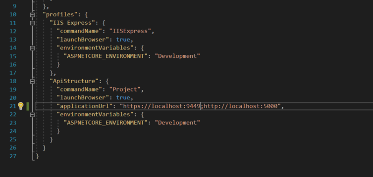

2. Cambia el puerto del perfil ApiStructure al 9449. Ejecuta la solución con ese perfil.

Para cambiar el puerto al 9449 basta con hacerlo en el fichero ```launchSettings.json```. En él están los dos perfiles con los que podemos debuggear. Lo mejor es cambiarlo en el perfil del proyecto:



3. Ataca a tu API con la url: https://localhost:9449/test. ¿Que te devuelve? (usa postman)

Siempre devuelve el mismo resultado: "Hello world!". Todas las direcciones de nuestro API devuelven lo mismo debido a la llamada ```app.Run();``` que hace que siempre se devuelva ese "Hello world!".

4. En lugar de devolver Hello world! en cada petición, devuelve la hora que el sistema se conecta, la hora de la request actual, y la hora en el que se hace el new de un servicio que se llame MiServicioConHora. Para ello usa la inyección de dependencias en sus tres formas.

Para ello hay que usar la inyección de dependencias con sus diferentes maneras del ciclo de vida. Para eso se han creado tres servicios y se han usado en el run del proyecto:

```csharp
app.Run(async (context) =>
{
    var miServicioScopedFirstCreated = context.RequestServices.GetService(typeof(IMiServicioScoped)) as IMiServicioScoped;
    var miServicioSingletonFirstCreated = context.RequestServices.GetService(typeof(IMiServicioSingleton)) as IMiServicioSingleton;
    var miServicioTrasientFirstCreated = context.RequestServices.GetService(typeof(IMiServicioTrasient)) as IMiServicioTrasient;

    await Task.Delay(2000);

    var miServicioScoped = context.RequestServices.GetService(typeof(IMiServicioScoped)) as IMiServicioScoped;
    var miServicioSingleton = context.RequestServices.GetService(typeof(IMiServicioSingleton)) as IMiServicioSingleton;
    var miServicioTrasient = context.RequestServices.GetService(typeof(IMiServicioTrasient)) as IMiServicioTrasient;

    await context.Response.WriteAsync($"Api Request: {miServicioSingleton.GetApiCreateDateTime()}. Date Request: {miServicioScoped.GetRequestDate()}. Date service: {miServicioTrasient.GetNewServiceDate()}.");
});
```

El Task.Delay está para poder diferenciar la hora de la llamada de la hora de cuando se crea un servicio. Antes del delay se crean los servicio para que el servicio de Scoped se cree la primera vez. Sino tanto el servicio scoped como el trasient se crearon a la vez y la hora será la misma.

Al final el servicio Singleton saca la hora que el API se despleg�, el servicio Scoped marca el principio de la llamada y el Trasient la hora que se crean los servicios nuevos.

5. Añade en el appsettings.json un parametro "ProjectSettings" y dentro de este otro con "ProjectName" cuyo valor será "ApiStructure". Saca ese valor en las requests como "Hello ".

Para ello hay que a�adir los par�metros al json de appsettings, luego hay que crear un objeto para mapear los valores y añadir este mapeo en el ConfigureServices:

appsettings.json:

```json
{
  "ProjectSettings": {
    "ProjectName": "ApiStructure"
  }
}
```

Startup:

```csharp
public class AppSettingsModel
{
    public ProjectSettings ProjectSettings { get; set; }
}

public class ProjectSettings
{
    public string ProjectName { get; set; }
}

public void ConfigureServices(IServiceCollection services)
{
    var serviceProvider = services.BuildServiceProvider();
    var configuration = serviceProvider.GetService<IConfiguration>();

    services.Configure<AppSettingsModel>(configuration);
}
```

6. Añade un fichero appsettings.staging.json donde el nombre del proyecto sea ApiStructureStaging. Ejecuta el proyecto en modo Staging y comprueba que ese es el nombre que usa ahora.

Para eso hay que crear el fichero ```appsettings.staging.json``` y ejecutar el proyecto en el entorno de Staging. Para cambiar el entorno del proyecto podemos modificarlo en el fichero ```launchSettings```.

7. Crea un servicio que se llame MiServicioEnProd que cumpla un interfaz IServiceEnvironment. Este interfaz tendrá un método que se llamará GetEnvironment y devolverá un string. Para el caso de MiServicioEnProd el servicio devolverá "Prod". Crea otro servicio que se llame MiServicioEnDev que implemente el interfaz IServiceEnvironment. En este caso el servicio devolverá "Dev" en el método GetEnvironment. Usa el servicio MiServicioEnDev solo cuando sea development el entorno que estamos ejecutando. Saca en la request "Hello <projectname>! This is environment <enviroment>"

Para el ejercicio 7 basta con poner un if por el entorno en el método ConfigureServices:

```csharp
public void ConfigureServices(IServiceCollection services)
{
    ...
    var environment = serviceProvider.GetService<IHostingEnvironment>();

    if (environment.IsDevelopment())
    {
        services.AddTransient<IServiceEnvironment, MiServicioEnDev>();
    }
    else
    {
        services.AddTransient<IServiceEnvironment, MiServicioEnProd>();
    }
	...
}
```

Para la solución en el proyecto se ha creado un método de extensión para crearlo todo con el patrón Builder. Con el método de extensión se puede pasar una condición y dependiendo de esto se procede con una opción o la otra:

```csharp
public static class IServiceCollectionExtensions
{
    public static IServiceCollection AddIfElse(
        this IServiceCollection services,
        bool condition,
        Func<IServiceCollection, IServiceCollection> actionIf,
        Func<IServiceCollection, IServiceCollection> actionElse)
    {
        return condition ? actionIf(services) : actionElse(services);
    }
}

public void ConfigureServices(IServiceCollection services)
{
    ...
    var environment = serviceProvider.GetService<IHostingEnvironment>();

    services.Configure<AppSettingsModel>(configuration)
            .AddIfElse(
                environment.IsDevelopment(), 
                servicesCollection => servicesCollection.AddTransient<IServiceEnvironment, MiServicioEnDev>(),
                servicesCollection => servicesCollection.AddTransient<IServiceEnvironment, MiServicioEnProd>());
}
```

8. Configura las settings para que se puedan refrescar en caliente. Haz la prueba de que funciona con el ejercicio anterior.

Para esto solo hay que cambiar el interfaz de IOptions por el de IOptionsSnapshot.

```csharp
public void Configure(IApplicationBuilder app, IHostingEnvironment env)
{
    app.Run(async (context) =>
    {
		...
        var configuration = context.RequestServices.GetService(typeof(IOptionsSnapshot<AppSettingsModel>)) as IOptionsSnapshot<AppSettingsModel>;

        await context.Response.WriteAsync(
            $"Hello { configuration.Value.ProjectSettings.ProjectName }!\n");
    });
}
```

9. Pon un logger en tu aplicación y logea un mensaje antes de enviar el mismo string que diga: "Siempre se hace la misma llamada".

Para configurar el logging lo podemos hacer en el ```Program.cs```:

```csharp
public static IWebHost BuildWebHost(string[] args) =>
    WebHost.CreateDefaultBuilder(args)
        .UseStartup<Startup>()
        .ConfigureAppConfiguration((hostingContext, configuration) =>
        {
            configuration
                .SetBasePath(hostingContext.HostingEnvironment.ContentRootPath)
                .AddJsonFile("appsettings.json", optional: false, reloadOnChange: true)
                .AddJsonFile($"appsettings.{hostingContext.HostingEnvironment.EnvironmentName}.json", optional: true, reloadOnChange: true)
                .AddUserSecrets<Program>()
                .AddEnvironmentVariables();
        })
        .ConfigureLogging((logging) =>
        {
            logging.ClearProviders();
            logging.AddConsole();
            logging.AddDebug();
        })
        .Build();
```

Y luego basta con usarlo en la clase ```Startup```:

```csharp
public void Configure(IApplicationBuilder app, ILogger<Startup> logger)
{
    app.Run(async (context) =>
    {
        logger.LogWarning("Siempre se hace la misma llamada");

		...
        await context.Response.WriteAsync("Hello World!");
    });
}
```

10. Devuelve un error 404 cuando el path de la request no empiece por "/api".

La función MapWhen nos permite realizar acciones dependiendo de la condición que le pongamos al principio. Para ello lo podemos resolver así:

```csharp
public void Configure(IApplicationBuilder app, IHostingEnvironment env, ILogger<Startup> logger)
{
    app.MapWhen(context => !context.Request.Path.StartsWithSegments("/api"),
                appBuilder =>
                {
                    appBuilder.Run(async (context) => context.Response.StatusCode = (int)HttpStatusCode.NotFound);
                })
        .Run(async (context) =>
        {
			await context.Response.WriteAsync("Hello World!");
        }
    );
}
```

11. Crea un middleware que compruebe si la peticion tiene una cabecera llamada x-language. Si es así, guarda ese valor en un servicio que se llame MiLenguaje, si no hay cabecera por defecto su valor será "esp". Este servicio deberá de ser el mismo en toda la llamada. Saca el valor de este lenguaje por pantalla en el mensaje con un: "Hello <projectname>! This is environment <enviroment>, el lenguaje utilizado es <lang>"

Para este ejercicio crearemos un servicio Scoped para guardar el valor del lenguaje. Con ese servicio podemos crear el siguiente middleware que coge su valor para usarlo luego:

```csharp
public class LanguageMiddleware
{
    private readonly RequestDelegate _next;
    public LanguageMiddleware(RequestDelegate next)
    {
        _next = next;
    }
    public async Task Invoke(HttpContext context, ILanguageService languageService)
    {
        if (context.Request.Headers.ContainsKey("x-language"))
        {
            var langHeader = context.Request.Headers.First(header => header.Key == "x-language");
            languageService.SetLanguage(langHeader.Value);
        }
        await _next.Invoke(context);
    }
}
```

Es importante no inyectar el servicio en el constructor, sino hacerlo en la función ```Invoke```. Si lo hacemos en el constructor nos daría un error ya que no se podría crear un servicio Scoped para un Middleware en su constructor ya que el Middleware al ponerlo en el pipeline es Singleton por defecto.

Luego basta con poner el Middleware en el pipeline del Configure:

```csharp
public class Startup
{
    public void ConfigureServices(IServiceCollection services)
    {
        var serviceProvider = services.BuildServiceProvider();
        var configuration = serviceProvider.GetService<IConfiguration>();
        var environment = serviceProvider.GetService<IHostingEnvironment>();

		...

        services.Configure<AppSettingsModel>(configuration)
                .AddScoped<ILanguageService, LanguageService>();
    }

    public void Configure(IApplicationBuilder app, IHostingEnvironment env, ILogger<Startup> logger)
    {
		...
        app.UseMiddleware<LanguageMiddleware>()
           .MapWhen(context => !context.Request.Path.StartsWithSegments("/api"),
                   appBuilder =>
                   {
                       appBuilder.Run(async (context) => context.Response.StatusCode = (int)HttpStatusCode.NotFound);
                   })
           .Run(async (context) =>
           {
		        var languageService = context.RequestServices.GetService(typeof(ILanguageService)) as ILanguageService;

				await context.Response.WriteAsync("Hello {languageService.GetLanguage()}!");
           }
        );
    }
}
```

